# LLM Task Processing System - Redesign Proposal

## Executive Summary

This proposal replaces Airflow with a **custom event-driven architecture** using Redis queues to solve two critical problems:

1. **Controlled traffic distribution** → Configurable, hot-reloadable percentages per model
2. **10-20x throughput improvement** → Eliminate convoy effect by using `/single` endpoint

---

## Problem: Why Replace Airflow?

| Current Issue | Impact |
|---------------|--------|
| **Batch endpoint convoy effect** | 9 tasks finish in 1s, 1 takes 2min → ALL wait 2min |
| **30s DAG scheduling latency** | Tasks wait for next DAG run |
| **Fixed 20-worker pool** | All models share, causing blocking |
| **No per-model traffic control** | Cannot set "30% GPT, 40% Claude, 30% Gemini" |
| **30-minute timeout** | Progress lost on restart |

---

## Key Design Decisions

| Decision | Rationale |
|----------|-----------|
| **`/single` over `/batch`** | Eliminates convoy effect. Each task processed independently. |
| **Per-model Redis queues** | Isolates models. One slow model doesn't block others. |
| **`FOR UPDATE SKIP LOCKED`** | Lock-free task claiming. Multiple routers can run safely. |
| **Token bucket rate limiting** | Atomic Lua script in Redis. Respects model quotas. |
| **Dynamic worker pools** | Scale 2-20 workers based on queue depth. |
| **Redis pub/sub for config** | Hot-reload traffic % without restart. |

---

## Navigation Guide

| Goal | File |
|------|------|
| Understand the data model | `db/schema.sql` |
| See how tasks are routed | `pseudocode/task_router.pseudo` |
| See how tasks are processed | `pseudocode/worker_pool.pseudo` |
| Understand rate limiting | `pseudocode/rate_limiter.pseudo` |
| See config hot-reload | `pseudocode/config_manager.pseudo` |
| Understand failure recovery | `pseudocode/recovery_job.pseudo` |
| View system architecture | `diagram/system_design.mmd` |

---

## Performance Comparison

| Metric | Current (Airflow + Batch) | Proposed (Custom + Single) |
|--------|---------------------------|----------------------------|
| Task pickup latency | ~30 seconds | < 100ms |
| Throughput | ~5 tasks/min | ~60 tasks/min |
| Per-model traffic control | ❌ | ✅ |
| Hot-reload config | ❌ | ✅ |
| Worker scaling | Fixed 20 | Dynamic 2-20 per model |

---

## System Architecture

```mermaid
graph TB
    subgraph ControlPlane["⚙️ Control Plane"]
        ConfigMgr["🔧 Config Manager<br/>━━━━━━━━━━<br/>• Hot-reload via Pub/Sub<br/>• 5s local cache TTL<br/>• Redis + DB fallback"]

        RateLimiter["🚦 Rate Limiter<br/>━━━━━━━━━━<br/>• Token bucket per model<br/>• Lua script (atomic)<br/>• Configurable capacity"]

        MetricsCol["📊 Metrics Collector<br/>━━━━━━━━━━<br/>• Prometheus client<br/>• Custom histograms<br/>• Real-time dashboards"]
    end

    subgraph TaskRouter["🔀 Task Router Service"]
        RouterLoop["♾️ Continuous Loop<br/>━━━━━━━━━━━━━━━━━━━━<br/>1. Poll DB (FOR UPDATE SKIP LOCKED)<br/>2. Get config (cached 5s)<br/>3. Select model (weighted random)<br/>4. Push to Redis queue<br/>5. Update status='queued'<br/>6. Sleep 100ms if idle"]
    end

    subgraph Queues["📋 Redis Queues"]
        Q1["queue:gpt<br/>━━━━━━━━<br/>LPUSH / BRPOP"]
        Q2["queue:claude<br/>━━━━━━━━<br/>LPUSH / BRPOP"]
        Q3["queue:gemini<br/>━━━━━━━━<br/>LPUSH / BRPOP"]
    end

    subgraph WorkerPools["👷 Worker Pools (asyncio)"]
        WP1["⚡ GPT Pool<br/>━━━━━━━━━━<br/>Dynamic: 2-20 workers<br/>Rate: 10 req/sec"]

        WP2["⚡ Claude Pool<br/>━━━━━━━━━━<br/>Dynamic: 2-30 workers<br/>Rate: 20 req/sec"]

        WP3["⚡ Gemini Pool<br/>━━━━━━━━━━<br/>Dynamic: 2-15 workers<br/>Rate: 15 req/sec"]
    end

    subgraph Backend["🤖 Models Backend"]
        Single["🎯 POST /single<br/>Response: 1s - 120s"]
    end

    subgraph Data["💾 PostgreSQL"]
        Tasks[("📋 tasks<br/>status, answer")]
        ModelConfig[("🔧 model_config<br/>traffic %, limits")]
    end

    subgraph Recovery["🔧 Recovery Cron Job"]
        RecoveryJob["⏰ Every 5 minutes<br/>━━━━━━━━━━━━━━━━━━<br/>1. Find processing > 5min<br/>2. attempts < 3 → reset<br/>3. attempts >= 3 → fail<br/>4. Alert if count > 10"]
    end

    %% Control plane connections
    ConfigMgr -.->|config| TaskRouter
    ConfigMgr -.->|config| WorkerPools

    %% Router connections
    Tasks -.->|poll| TaskRouter
    TaskRouter -->|"LPUSH"| Q1
    TaskRouter -->|"LPUSH"| Q2
    TaskRouter -->|"LPUSH"| Q3

    %% Queue to workers
    Q1 -->|"BRPOP"| WP1
    Q2 -->|"BRPOP"| WP2
    Q3 -->|"BRPOP"| WP3

    %% Rate limiting
    RateLimiter -.->|acquire| WP1
    RateLimiter -.->|acquire| WP2
    RateLimiter -.->|acquire| WP3

    %% Worker to backend
    WP1 -->|"POST"| Single
    WP2 -->|"POST"| Single
    WP3 -->|"POST"| Single

    %% Workers to DB
    WP1 -.->|update| Tasks
    WP2 -.->|update| Tasks
    WP3 -.->|update| Tasks

    %% Metrics
    WP1 -.-> MetricsCol
    WP2 -.-> MetricsCol
    WP3 -.-> MetricsCol

    %% Recovery
    RecoveryJob -->|scan & fix| Tasks
```

---

## Core Components

### 1. Task Router
- Continuous loop polling PostgreSQL
- `FOR UPDATE SKIP LOCKED` prevents duplicate processing
- Weighted random model selection with queue depth penalty
- Pushes to per-model Redis queues

### 2. Worker Pool (per model)
- Dynamic scaling based on queue depth
- `BRPOP` for blocking queue consumption
- Rate limiting before each API call
- Retry logic with exponential backoff

### 3. Rate Limiter
- Token bucket algorithm
- Atomic Lua script in Redis
- Per-model capacity and refill rate

### 4. Config Manager
- 5-second local cache
- Redis pub/sub for instant invalidation
- Database as source of truth

### 5. Recovery Job
- Runs every 5 minutes
- Resets tasks stuck in "processing" > 5 min
- Fails tasks exceeding max retries

---